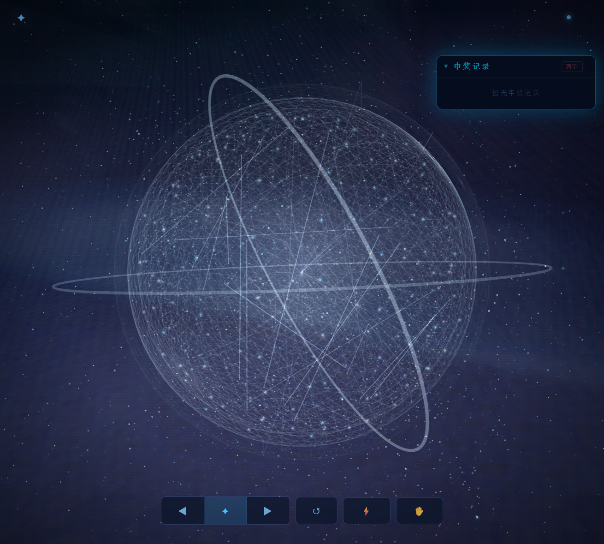

# ✦ 星尘抽奖 · Stardust Lottery

<p align="center">
  
</p>

<p align="center">
  
  
  
  
</p>

> 基于 Three.js 的 3D 粒子抽奖系统。手势控制、22 个星座主题粒子球、稀有度差异化特效，纯静态部署，克隆即用。

## 🚀 快速开始

```bash
git clone https://github.com/Z5zhl/stardust-lottery.git
cd stardust-lottery
python -m http.server 9999
# 打开 http://localhost:9999/gesture-particles/stardust-lottery.html
```

> ⚠️ 不支持 `file://` 协议直接打开，必须通过 HTTP 服务器访问。

## 🌐 在线体验

**[https://z5zhl.github.io/stardust-lottery/](https://z5zhl.github.io/stardust-lottery/)**

## ⌨️ 操作

| 按键 | 功能 |
|------|------|
| `←` `→` | 切换粒子球（22 个星座主题） |
| `空格` | 抽取奖品 |
| `R` | 重置 |
| `A` | 自动连续抽取 |
| 鼠标拖拽 | 360° 旋转视角 |

**手势控制**（需摄像头，点击右下角 ✋ 开启）：

| 手势 | 功能 |
|------|------|
| 张开五指 | 粒子发散 |
| 握拳 | 爆炸抽取 |
| 食指单出 | 下一个粒子球 |
| 食指+中指 | 上一个粒子球 |
| 手部移动 | 旋转粒子球 |

## 🎁 添加奖品

**文件名即配置，零代码修改。**

```
gesture-particles/prizes/
  ├── 3.神秘大礼.png        → 权重=3（传说级），图片奖品
  ├── 5.星辰大海.png        → 权重=5（稀有级），图片奖品
  └── 8.心想事成_x2.txt     → 权重=8（普通级），限抽 2 次
```

| 权重 | 稀有度 | 特效 |
|------|--------|------|
| 1 ~ 4 | ⭐ 传说 | 金色粒子皇冠、14 道光柱、5 层冲击波、12 秒展示 |
| 5 ~ 7 | ✦ 稀有 | 蓝色粒子皇冠、6 道光柱、3 层冲击波、8 秒展示 |
| 8+ | · 普通 | 灰色粒子、1 层冲击波、6 秒展示 |

**步骤：**
1. 按格式命名文件放入 `gesture-particles/prizes/`
2. 编辑 `gesture-particles/prizes.json`，添加对应条目
3. 刷新页面

## 📁 项目结构

```
stardust-lottery/
├── index.html                          # 入口页
├── preview.png                         # 预览截图
├── gesture-particles/
│   ├── stardust-lottery.html           # 抽奖主页面
│   ├── prizes.json                     # 奖品数据
│   ├── prizes/                         # 奖品文件（12个）
│   └── js/
│       ├── gesture-controller.js       # 手势识别引擎
│       └── stardust-gesture.js         # 手势控制系统
└── libs/mediapipe/                     # AI 手势识别（仅保留必需）
    ├── vision_bundle.mjs               # 核心识别库
    ├── hand_landmarker.task            # 手部模型
    └── wasm/                           # WebAssembly 运行时
```

## 🔧 技术栈

| 技术 | 用途 | 加载方式 |
|------|------|----------|
| Three.js 0.160 | 3D 粒子渲染 | CDN 自动加载 |
| MediaPipe Vision | 手势关键点识别 | 本地 `libs/mediapipe/` |
| WebGL | 粒子着色器特效 | 浏览器内置 |

## ❓ 常见问题

**Q: 为什么打开后没有奖品？**  
A: 必须通过 HTTP 服务器访问（如 `python -m http.server`），不能直接双击 HTML 文件。

**Q: 手势控制没反应？**  
A: 点击右下角 ✋ 按钮，允许浏览器使用摄像头。需要 HTTPS 或 localhost 环境。

**Q: 如何自定义奖品？**  
A: 在 `prizes/` 文件夹放入按格式命名的文件，再编辑 `prizes.json` 添加对应条目即可。

**Q: 如何部署到线上？**  
A: 整个项目是纯静态的，直接上传到 GitHub Pages、Vercel、Netlify 等任意静态托管平台即可。

## 📄 License

MIT © 2026